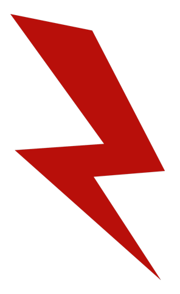

# Slums Gangs
## Tiu’Meng: the Freakshow of Slums

> Блядь, Стив, чтоб я еще раз пошел по твоей наводке в трущобы – я такого пиздеца еще ни разу не видел. Ты, сука видел, что они с ней сделали? Ты, нахуй, это видел? Я, сука, лучше корпам скажу, что у них промышленным шпионажем занимаюсь, они хотя бы просто в голову пальнут. Ни ногой, слышал меня?

Трущобы города Тю’Мень славятся своим доступным жильем, низкими ценами на продукты питания, простой одноэтапной системой кредитования и, конечно же, бандами неуравновешенных индивидуумов. Они сбиваются в стаи, как бродячие псы, образовывая силы, с которыми приходится считаться остальным жителям кварталов бедняков. У фриков трущоб низкие продолжительность жизни, интеллектуальное развитие, уровень финансового благополучия, социальная ответственность и прочие атрибуты, которые ценят адекватные жители города. Далее представлены самые крупные банды фриков, терроризирующих трущобы города Тю’Мень.

Серые кости

  \
Банда серых коcтей – сборище отбитых представителей Тю’Мени вне зависимости от расы или пола, ведь для Костей важно то, что у тебя внутри. Серые кости выделяются мертвецким гримом на лицах и татуировками в виде костей на разных частях тела в зависимости от статуса в банде. Вместо чернил для татуировок используется зола из жженых костей, а татуировщиков называют «костоправами», замедляющих гниение тел членов банды самопальными припарками. Живут кости за счет убийств и грабежа, не производя ничего своего кроме низкокачественной спиртяги и синтетических наркотиков, после которых с костей отслаивается кожа и плоть. Впрочем, демонстрация собственных костей — это почетно и уважаемо в данной банде.
У Костей есть своя иерархия, обозначающаяся соответствующими татуировками. Низшее звено — это «Зомби» - он еще достаточно здоровый и у него нет татуировок. Чуть выше находятся «Ноги» - эти ребята заслужили свои первые татуировки за то, что убили другого человека и обглодали мясо с его ног, из которых и делаются чернила для первой наколки. Затем идут «Плечи» - основные бойцы банды с татуировками на плечах, за ними следят «Ребра» - сержанты Серых костей. Главный в банде это «Череп», у него забито все лицо, а голова увенчана короной из забитых в черепную коробку зубов. У Черепа есть три главных помощника – «Правая» и «Левая» руки, а также «Хребет», у каждого из которых свои задачи в этом прекрасном сборище.  \
  \
**Прозвища:** Кости, Скелеты, Погремухи, Костяны, Дрищи  \
**Численность:** ~100  \
**Зоны влияния:** Трущобы  \
**Авторитет:** 2/5  \
**Виды деятельности:** разбой, грабеж  \
**Ресурсы:** 0/5  \
**Боеспособность:** 1/5  \
**Магия:** 0/5

Красные молнии

  \
Жизнь в Тю’Мени летит очень быстро, но не так быстро, как хотелось бы этим ребятам. Скорость – главное в жизни красных молний. Эта банда не представляет себе хоть один день без быстрой езды на болидах, собранных из магического лома. Молнии контролируют большинство свалок в трущобах и постоянно копаются в хламе в поисках чего-нибудь ценного. Остальным желающим поживиться на грудах мусора приходится платить пошлину гонщикам. Кожаные куртки, большие защитные очки, татуировки в виде молний, аугментации для улучшения рефлексов – так выглядят ребята, для которых скорость это главный наркотик, как в прямом, так и в переносном смысле. Если гонщик банды молний не летит на огромной скорости по городу, то он разгоняет спидами свое собственное тело, после чего в раже разносит все вокруг шипованной битой.
Естественно, молнии не белые и пушистые – их заезды частенько сопровождаются фейерверками и взрывами, разносящими в щепки трущобные дома и иногда даже людей. Их основной источник заработка – свалки, с которых артефайсеры молний набирают хлам и превращают его в болиды, но также они зарабатывают на продаже своих фирменных спидов «Редлайт» и на тотализаторах на собственные заезды. Иногда водителей молний нанимают для того, чтобы доставить посылку, когда главное – это анонимность и скорость.   \
  \
**Прозвища:** Молнии, Гонщики, Водилы, Спидоры, Стервятники  \
**Численность:** ~130  \
**Зоны влияния:** Трущобы, внешний круг  \
**Авторитет:** 2/5  \
**Виды деятельности:** сборка магического хлама, наркотики, тотализаторы  \
**Ресурсы:** 2/5  \
**Боеспособность:** 1/5  \
**Магия:** 0/5

Чистильщики

  \
Далеко не всем нравится расовое разнообразие Тю’Мени, но эти ребята выводят расовую ненависть на особый уровень. Чистильщики всей душой ненавидят всех, кто не похож на людей – эльфов, гномов, дворфов, орков, ящеров, тифлингов (особенно тифлингов) и многих других. Их крестовый поход идет сразу в двух плоскостях: они уничтожают нелюдей грубой силой и отравляют их изнутри. Каждую четвертую неделю чистильщики собираются в большую ватагу и устраивают «Сальпиеву Ночь» - погром с невероятно жестоким убийством нелюдей наименее гуманными способами. Но затем следующие четыре недели они варят самый отвратительный алкоголь и самые низкокачественные наркотики, какие возможно, чтобы потом продать свою дурь нелюдям в других кварталах, разрушая их изнутри. Естественно, они считают себя рыцарями, защищающими мир от грязной крови, а за защиту нужно платить. Подминая под свой контроль кварталы, они собирают с людей деньги за защиту.
Тело чистильщика должно быть чистым, а дух должен быть здоровым, поэтому на коже этих бандитов нет ни одной татуировки, а за употребления наркотиков и алкоголя следует публичное избиение металлической трубой. Впрочем, это не значит, что никто в этой банде не злоупотребляет веществами, просто делают это скрытно. Единственные отличительные черты чистильщиков – алюминиевые или серебряные цепи, лежащие на белых майках, обтягивающих мускулы рэкетиров. Любимая аугментация этой банды – металлический хромированный кулак.  \
  \
**Прозвища:** Мерилы, Белые, Черепомеры, Расисты  \
**Численность:** ~150  \
**Зоны влияния:** Трущобы  \
**Авторитет:** 3/5  \
**Виды деятельности:** рэкет, наркоторговля, разбой  \
**Ресурсы:** 2/5  \
**Боеспособность:** 1/5  \
**Магия:** 0/5

